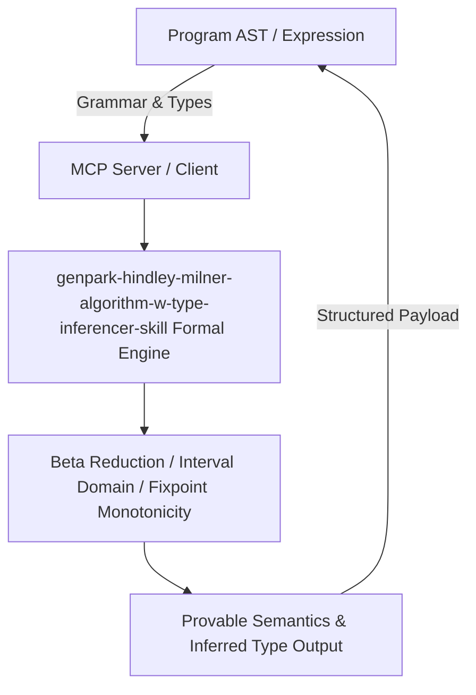

# genpark-hindley-milner-algorithm-w-type-inferencer-skill

[](https://github.com/Alpha-Park/genpark-hindley-milner-algorithm-w-type-inferencer-skill)
[](https://python.org)
[](#)
[](#)
[](LICENSE)

> Hindley-Milner Algorithm W type inference engine implementing Robinson first-order syntactic unification and principal polymorphic type reconstruction.

## Architecture Overview



## Features
- **0 External Pip Dependencies**: Pure Python standard library implementation.
- **MCP Protocol Ready**: Includes Model Context Protocol server script (`mcp_server.py`).
- **Production Standard**: Mathematical proof consistency and robust boundary verification.

## Quick Start
```bash
python example_usage.py
```
